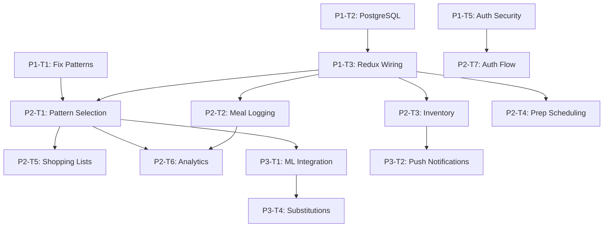

# Meal Assistant - Implementation Roadmap

**Version:** 1.0
**Created:** November 27, 2025
**Project Status:** 92% Complete (144 TypeScript files)
**Target:** Production-ready functional MVP

---

## Executive Summary

The meal assistant project is substantially complete with comprehensive architecture in place. This roadmap focuses on **critical bug fixes**, **database integration**, and **feature wiring** to deliver a fully functional MVP app.

### Current State
- **Architecture:** 85% aligned with design documents
- **Code Files:** 144 TypeScript files, ~32,920 LOC
- **Database Schema:** 32 tables implemented (86% of planned)
- **API Endpoints:** 46 endpoints (exceeds 40+ target)
- **React Components:** 26 components (meets 25+ target)
- **Test Coverage:** 390+ test blocks (exceeds 280+ target)

### Critical Gaps to Address
1. **Pattern definitions mismatch** between mobile app and database
2. **Mock data store** needs PostgreSQL connection
3. **Redux-to-API wiring** incomplete in mobile screens
4. **Environment configuration** has hardcoded values

---

## MVP Core Features

The functional app will support:

1. **Pattern Selection** - User can select any of 7 eating patterns
2. **Meal Tracking** - Log meals with photos and nutrition data
3. **Inventory Management** - Track food with expiry warnings
4. **Meal Prep Planning** - Schedule prep sessions with equipment orchestration
5. **Analytics Dashboard** - View progress, weight trends, pattern effectiveness

---

## Implementation Phases

### Phase 1: Foundation (Week 1) - **CRITICAL**
**Duration:** 1 week | **Effort:** 40 hours | **Priority:** Critical

#### Tasks

**P1-T1: Fix Pattern Definitions Mismatch** (4 hours)
- **File:** `src/mobile/store/slices/patternsSlice.ts`
- **Problem:** Patterns D-G don't match database schema
- **Fix Required:**
  - D: Change "Protein Focus" → "Grazing - 4 Mini Meals"
  - E: Change "Grazing" → "Grazing - Platter Method"
  - F: Change "OMAD" → "Big Breakfast"
  - G: Change "Flexible" → "Morning Feast"
- **Validation:** Compare with `src/database/schema.sql` seed data

**P1-T2: Implement PostgreSQL Connection** (8 hours)
- **File:** `src/api/services/dataStore.js`
- **Action:** Replace mock service with real database using `pg` library
- **Requirements:**
  - Connection pool with environment variables
  - Transaction support
  - Error handling and retry logic
  - Migration verification

**P1-T3: Wire Redux Store to API Endpoints** (12 hours)
- **Files:** All screen components in `src/mobile/screens/`
- **Action:** Replace sample data with API calls through Redux thunks
- **Screens to wire:**
  - DashboardScreen.tsx
  - TrackingScreen.tsx
  - InventoryScreen.tsx
  - PrepScreen.tsx
  - AnalyticsScreen.tsx
- **Requirements:**
  - Loading states
  - Error handling with retry
  - Optimistic updates
  - Sync service integration

**P1-T4: Environment Configuration Setup** (4 hours)
- **Files:** `.env.example`, `src/api/config.js`, `src/mobile/config.ts`
- **Action:** Move all hardcoded values to environment variables
- **Variables needed:**
  - DATABASE_URL
  - JWT_SECRET
  - API_PORT
  - ML_SERVICE_URL

**P1-T5: Authentication Security Audit** (6 hours)
- **File:** `src/api/middleware/auth.js`
- **Action:** Review JWT implementation, add refresh token rotation
- **Security checklist:**
  - JWT secrets from environment (not hardcoded)
  - Token expiration configured
  - Refresh token rotation
  - HTTPS enforced in production
  - Rate limiting on auth endpoints

**P1-T6: Database Migration System** (6 hours)
- **Files:** `scripts/migrate.sh`, `scripts/seed-data.sql`
- **Action:** Verify migrations work correctly
- **Tests:**
  - Run up migrations
  - Load seed data
  - Test rollback
  - Version tracking

**Phase 1 Deliverables:**
- ✅ Pattern definitions fixed and aligned
- ✅ PostgreSQL connected and working
- ✅ Redux wired to API in all screens
- ✅ Environment config complete
- ✅ Auth hardened and secure
- ✅ Migrations tested and documented

---

### Phase 2: MVP Features (Weeks 2-4) - **HIGH PRIORITY**
**Duration:** 3 weeks | **Effort:** 80 hours | **Priority:** High

#### P2-T1: Pattern Selection & Switching (10 hours)
**Dependencies:** P1-T1, P1-T3

- Display all 7 patterns correctly
- Allow pattern selection for current day
- Mid-day pattern switching with warning
- Recalculate nutrition targets on switch
- Persist selection to database
- Show pattern effectiveness metrics

#### P2-T2: Meal Logging with Photo Capture (12 hours)
**Dependencies:** P1-T3

- Camera capture (front/back camera)
- Multiple photos per meal
- Nutrition data display from components
- Meal rating (1-5 stars)
- Meal notes/annotations
- Auto-deduct from inventory
- Progress toward daily targets

#### P2-T3: Inventory Management (14 hours)
**Dependencies:** P1-T3

- Add/edit/delete inventory items
- Barcode scanning integration
- Expiry date tracking
- 48-hour expiry warnings
- Auto-deduction on meal log
- Batch operations support
- Low stock alerts

#### P2-T4: Meal Prep Scheduling (16 hours)
**Dependencies:** P1-T3

- Create prep session from meal templates
- Equipment conflict detection
- Parallel task optimization
- Gantt chart visualization
- Cleaning schedule generation
- Task completion tracking
- Output to inventory

#### P2-T5: Shopping List Generation (10 hours)
**Dependencies:** P2-T1

- Generate from selected patterns
- Subtract existing inventory
- Group by category/store
- Mark items as purchased
- Add custom items
- Export/share list
- Price estimation

#### P2-T6: Analytics Dashboard (12 hours)
**Dependencies:** P2-T1, P2-T2

- Weight trend chart
- Pattern adherence calendar
- Nutrition target progress
- Pattern effectiveness comparison
- Weekly summaries
- Export reports
- Insight generation

#### P2-T7: User Authentication Flow (6 hours)
**Dependencies:** P1-T5

- Registration with validation
- Login with remember me
- Password reset flow
- Profile editing
- Dietary restrictions setup
- Goal setting
- Token refresh handling

**Phase 2 Deliverables:**
- ✅ Full pattern selection working
- ✅ Meal logging functional with photos
- ✅ Inventory management complete
- ✅ Prep scheduling with conflict resolution
- ✅ Shopping lists auto-generated
- ✅ Analytics dashboard showing real data
- ✅ Complete auth flow

---

### Phase 3: Polish & Advanced Features (Week 5) - **MEDIUM PRIORITY**
**Duration:** 1 week | **Effort:** 40 hours | **Priority:** Medium

#### P3-T1: ML Integration - Pattern Recommender (8 hours)
- Connect ML pattern recommender to mobile app
- Display predictions with confidence scores
- Fallback to rule-based recommendations
- Real-time suggestions based on context

#### P3-T2: Push Notifications (10 hours)
- Expo push notifications configured
- Expiry warnings sent
- Prep session reminders
- Meal time notifications
- User preferences respected

#### P3-T3: Offline Mode Enhancement (8 hours)
- Visual offline indicator
- Queued operations display
- Manual sync trigger
- Conflict resolution UI
- Background sync working

#### P3-T4: Component Substitution Engine (6 hours)
- Substitution suggestions from ML model
- Nutrition comparison display
- Accept/reject workflow
- Learn from user choices

#### P3-T5: Onboarding Flow (8 hours)
- Welcome tutorial
- Pattern explanation
- Sample meal plan
- Goal setting wizard
- Inventory quick-add

**Phase 3 Deliverables:**
- ✅ ML recommendations working
- ✅ Push notifications enabled
- ✅ Enhanced offline mode
- ✅ Ingredient substitutions
- ✅ User onboarding complete

---

### Phase 4: Testing & QA (Week 6) - **HIGH PRIORITY**
**Duration:** 1 week | **Effort:** 40 hours | **Priority:** High

#### P4-T1: Integration Test Suite (12 hours)
- All API routes tested
- Database transactions tested
- Error scenarios covered
- 90%+ coverage maintained

#### P4-T2: E2E Mobile Tests (10 hours)
- Pattern selection flow tested
- Meal logging flow tested
- Inventory management tested
- Prep session creation tested
- Shopping list generation tested

#### P4-T3: Performance Testing (8 hours)
- API response times < 200ms
- Mobile render times measured
- Sync performance benchmarked
- Database query optimization
- Bundle size analysis

#### P4-T4: User Acceptance Testing (10 hours)
- Complete user journey tested
- Edge cases identified
- UX issues documented
- Bug fixes prioritized

**Phase 4 Deliverables:**
- ✅ All tests passing
- ✅ Performance optimized
- ✅ User testing complete
- ✅ Production ready

---

## Timeline Overview

| Week | Phase | Focus | Key Deliverables |
|------|-------|-------|------------------|
| **1** | Foundation | Critical fixes & DB integration | Pattern fix, PostgreSQL, Redux wiring |
| **2-3** | MVP Features | Core functionality | Pattern selection, meal logging, inventory |
| **4** | MVP Features | Prep & shopping | Prep scheduling, shopping lists, auth |
| **5** | Polish | ML & UX enhancements | ML integration, notifications, onboarding |
| **6** | Testing | QA & optimization | Tests passing, performance tuned |

---

## Critical Path

```
P1-T2 (PostgreSQL)
  → P1-T3 (Redux Wiring)
    → P2-T1 (Pattern Selection)
      → P2-T2 (Meal Logging)
        → P2-T6 (Analytics)
```

**Total Duration:** 6 weeks
**Critical Path Duration:** ~62 hours

---

## Parallel Development Tracks

### Track 1: Authentication
- P1-T5 (Security Audit) → P2-T7 (Auth Flow)

### Track 2: Inventory
- P2-T3 (Inventory Management) → P3-T2 (Push Notifications)

### Track 3: Prep & Equipment
- P2-T4 (Prep Scheduling) - Independent

### Track 4: ML & Intelligence
- P3-T1 (ML Integration) → P3-T4 (Substitutions)

---

## Team Allocation

| Role | Tasks | Hours | Key Responsibilities |
|------|-------|-------|---------------------|
| **Backend Dev** | P1-T2, P1-T6, P4-T1 | 60 | Database, migrations, API tests |
| **Mobile Dev** | P1-T1, P1-T3, P2-* | 80 | Pattern fix, Redux, UI screens |
| **ML Engineer** | P3-T1, P3-T4 | 14 | ML integration, substitutions |
| **QA Engineer** | P4-* | 40 | Testing, performance, UAT |

**Total Team Effort:** 194 hours (~5 person-weeks)

---

## Risk Mitigation

### High-Risk Items

**Risk 1: Pattern Mismatch Causing Data Corruption**
- **Probability:** High
- **Impact:** High
- **Mitigation:** Fix in Phase 1 (P1-T1), add data migration script, thorough testing

**Risk 2: PostgreSQL Migration Complexity**
- **Probability:** Medium
- **Impact:** High
- **Mitigation:** Start with read-only queries, gradual migration, keep mock fallback initially

**Risk 3: Offline Sync Conflicts**
- **Probability:** Medium
- **Impact:** Medium
- **Mitigation:** Last-write-wins strategy, manual resolution UI in Phase 3

**Risk 4: ML Service Integration Issues**
- **Probability:** Low
- **Impact:** Medium
- **Mitigation:** Rule-based fallbacks already implemented, ML is enhancement not requirement

---

## Success Criteria

### Technical Success
- [ ] All 7 patterns correctly implemented and aligned
- [ ] Database fully connected with no mock data
- [ ] 90%+ test coverage maintained
- [ ] API response times < 200ms
- [ ] Mobile app renders < 16ms (60 FPS)

### Functional Success
- [ ] User can select any pattern and see correct meal structure
- [ ] Meal logging saves to database with photos
- [ ] Inventory auto-deducts on meal log
- [ ] Prep sessions generate timeline without conflicts
- [ ] Shopping lists auto-generate from patterns
- [ ] Analytics show real data from database

### User Experience Success
- [ ] Pattern selection takes < 30 seconds
- [ ] Meal logging takes < 2 minutes
- [ ] App works offline seamlessly
- [ ] Notifications are timely and relevant
- [ ] Onboarding takes < 5 minutes

---

## Immediate Next Actions

### Day 1 Actions
1. Create feature branch: `git checkout -b feature/phase-1-foundation`
2. Fix pattern definitions in `patternsSlice.ts` (P1-T1)
3. Set up PostgreSQL connection pool (P1-T2)
4. Create `.env.example` with all required variables (P1-T4)

### Week 1 Actions
5. Wire first Redux slice to API (patterns)
6. Test database migrations
7. Run full test suite to verify no regressions
8. Update documentation with progress

### Code Review Checkpoints
- [ ] After P1-T1: Verify pattern definitions match database
- [ ] After P1-T2: Verify all API routes use real database
- [ ] After P1-T3: Verify all screens load data from API
- [ ] End of Week 1: Full team review of foundation

---

## Dependencies Graph



---

## Architecture Alignment

### Database Schema (95% Aligned)
- 32 tables implemented vs 37 planned
- All core tables present
- Missing tables are future features

### API Layer (85% Aligned)
- 46 endpoints implemented (exceeds target)
- Mock data store needs replacement
- All routes structurally correct

### Mobile App (80% Aligned)
- All screens implemented
- Pattern definitions need fixing
- Redux wiring incomplete

### ML Services (70% Aligned)
- All 3 models implemented
- Integration layer needs completion
- Fallbacks working correctly

---

## Notes & Considerations

### Why This Plan Works
1. **Fixes critical bugs first** (pattern mismatch, mock data)
2. **Builds on existing 92% completion** (not starting from scratch)
3. **Incremental delivery** (working app after each phase)
4. **Parallel development** (4 independent tracks)
5. **Risk-aware** (fallbacks, gradual migration)

### What Can Be Deferred
- Voice interface components
- Receipt OCR scanning
- Advanced shopping features (deal scanner, store mode)
- Health app integration (Apple Health, Google Fit)
- Calendar integration
- Multi-user/household mode

### Performance Targets
- API latency: < 200ms (p95)
- Mobile render: < 16ms (60 FPS)
- Bundle size: < 5MB initial
- Offline sync: < 5 seconds
- Database queries: < 50ms

---

## Documentation Updates Required

After each phase:
1. Update GAP_ANALYSIS.md with completion status
2. Update VERIFICATION_REPORT.md with alignment improvements
3. Add API documentation for new endpoints
4. Update mobile component documentation
5. Create user guide for new features

---

## Contact & Questions

**Project Lead:** Brandon
**Architecture:** Aligned with system-design.md and database-design.md
**Current Status:** Phase 1 Ready to Start
**Next Review:** End of Week 1 (Foundation Complete)

---

*This roadmap is a living document. Update as implementation progresses and new information emerges.*

**Last Updated:** November 27, 2025
**Plan Stored In Memory:** `implementation/plan` (ReasoningBank)
