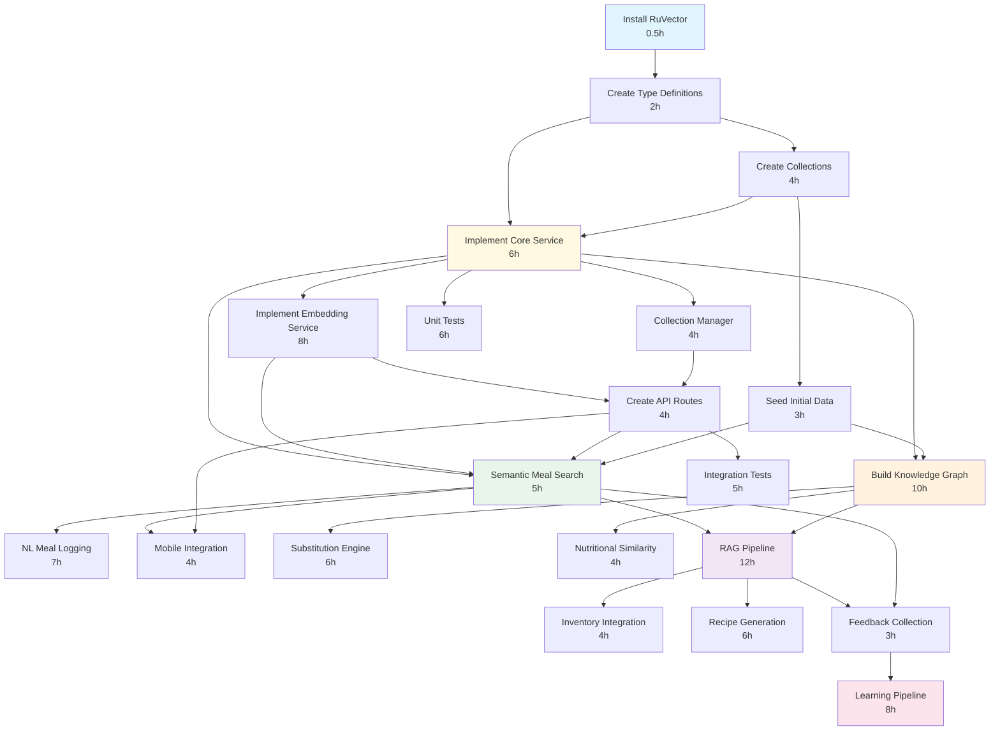

# RuVector Integration - GOAP Implementation Plan

**Generated:** 2025-12-01
**Status:** Planning Phase
**Methodology:** Goal-Oriented Action Planning (GOAP)

---

## Executive Summary

This document outlines the complete implementation plan for integrating RuVector into the meal assistant application. The plan is generated using GOAP methodology, which allows for:

- **Adaptive Planning**: Can replan if actions fail or requirements change
- **Dependency Tracking**: Automatically orders actions based on preconditions
- **Cost Optimization**: Finds the most efficient path to goals
- **Risk Management**: Identifies high-risk actions and provides rollback procedures

### Key Metrics

- **Total Phases**: 6 (0-5)
- **Total Actions**: 19 core actions
- **Estimated Time**: 80-100 hours
- **Estimated Duration**: 10-13 working days (8h/day)
- **Critical Path**: Infrastructure → Core → Search → Graph → RAG → Learning

---

## Dependency Graph



---

## Phase 0: Infrastructure (9.5 hours, 1.5 days)

**Objective**: Set up the foundational infrastructure for RuVector integration.

**Goal State**:
- ✓ RuVector installed and configured
- ✓ Type definitions created
- ✓ Collections created with proper schemas
- ✓ Initial data seeded

### Action 0.1: Install RuVector Package

**Priority**: Critical
**Estimated Time**: 0.5 hours
**Risk**: Low

**Preconditions**: None (starting point)

**Commands**:
```bash
# Install RuVector and type definitions
npm install ruvector --save
npm install @types/ruvector --save-dev

# Verify installation
npm list ruvector
```

**Files Modified**:
- `package.json`
- `package-lock.json`

**Validation**:
- [ ] package.json contains ruvector dependency
- [ ] node_modules/ruvector directory exists
- [ ] Can import ruvector in TypeScript without errors

**Rollback**: Remove from package.json and run `npm install`

---

### Action 0.2: Create Type Definitions

**Priority**: Critical
**Estimated Time**: 2 hours
**Risk**: Low

**Preconditions**:
- ✓ ruvectorInstalled

**Commands**:
```bash
# Create type definitions directory
mkdir -p src/services/vector/types

# Create type definition files (see Files Created below)
```

**Files Created**:
- `src/services/vector/types/index.ts` - Main exports
- `src/services/vector/types/collections.ts` - Collection interfaces
- `src/services/vector/types/embeddings.ts` - Embedding types
- `src/services/vector/types/queries.ts` - Query interfaces

**Example Type Definition** (`src/services/vector/types/collections.ts`):
```typescript
export interface MealVector {
  id: string;
  embedding: number[];
  metadata: {
    name: string;
    calories: number;
    protein: number;
    carbs: number;
    fat: number;
    tags: string[];
    patternCompatibility: string[];
  };
  timestamp: Date;
}

export interface RecipeVector {
  id: string;
  embedding: number[];
  metadata: {
    name: string;
    ingredients: string[];
    instructions: string[];
    cookTime: number;
    servings: number;
    difficulty: 'easy' | 'medium' | 'hard';
  };
  timestamp: Date;
}

export interface CollectionConfig {
  name: string;
  dimension: number;
  indexType: 'hnsw' | 'flat' | 'ivf';
  metric: 'cosine' | 'euclidean' | 'dot';
}
```

**Validation**:
- [ ] TypeScript compiles without errors: `npm run typecheck`
- [ ] All types properly exported
- [ ] No circular dependencies

**Tests**:
- `tests/unit/types/vector-types.test.ts` - Type safety and structure tests

---

### Action 0.3: Create Vector Collections

**Priority**: Critical
**Estimated Time**: 4 hours
**Risk**: Medium

**Preconditions**:
- ✓ ruvectorInstalled
- ✓ typeDefinitionsExist

**Commands**:
```bash
# Create collections directory
mkdir -p src/services/vector/collections

# Create collection schemas (see Files Created)

# Run initialization script
npm run vector:init-collections
```

**Files Created**:
- `src/services/vector/collections/meal-collection.ts`
- `src/services/vector/collections/recipe-collection.ts`
- `src/services/vector/collections/ingredient-collection.ts`
- `src/services/vector/collections/user-preference-collection.ts`
- `scripts/vector/initialize-collections.ts`

**Example Collection Schema** (`src/services/vector/collections/meal-collection.ts`):
```typescript
import { RuVector } from 'ruvector';
import { CollectionConfig, MealVector } from '../types';

export class MealCollection {
  private collection: RuVector.Collection;

  static readonly CONFIG: CollectionConfig = {
    name: 'meals',
    dimension: 768, // BERT embedding size
    indexType: 'hnsw',
    metric: 'cosine',
  };

  async initialize(): Promise<void> {
    this.collection = await RuVector.createCollection({
      ...MealCollection.CONFIG,
      schema: {
        fields: [
          { name: 'id', type: 'string', primary: true },
          { name: 'embedding', type: 'vector', dimension: 768 },
          { name: 'metadata', type: 'json' },
          { name: 'timestamp', type: 'datetime' },
        ],
        indexes: [
          { field: 'metadata.patternCompatibility', type: 'array' },
          { field: 'timestamp', type: 'btree' },
        ],
      },
    });
  }

  async insert(meal: MealVector): Promise<void> {
    await this.collection.insert(meal);
  }

  async search(
    query: number[],
    filters?: Record<string, any>,
    limit: number = 10
  ): Promise<MealVector[]> {
    return await this.collection.search({
      vector: query,
      filters,
      limit,
    });
  }
}
```

**Validation**:
- [ ] All collections created successfully
- [ ] Collections are queryable
- [ ] Schemas match expected structure
- [ ] Integration tests pass

**Tests**:
- `tests/integration/vector/collections.test.ts`

**Rollback**:
```bash
# Drop all collections
npm run vector:drop-collections
```

---

### Action 0.4: Seed Initial Data

**Priority**: High
**Estimated Time**: 3 hours
**Risk**: Low

**Preconditions**:
- ✓ collectionsCreated

**Commands**:
```bash
# Create seeding scripts
mkdir -p scripts/vector/seed

# Run seeding
npm run vector:seed
```

**Files Created**:
- `scripts/vector/seed-data.ts` - Main seeding orchestrator
- `src/services/vector/seeding/data-converter.ts` - Convert existing data
- `src/services/vector/seeding/embedding-generator.ts` - Generate embeddings

**Seeding Strategy**:
1. Extract existing meals from PostgreSQL
2. Generate embeddings using OpenAI/local model
3. Transform to vector format
4. Bulk insert into collections
5. Verify data integrity

**Data Volume**:
- ~1000 meals
- ~500 recipes
- ~200 ingredients
- ~50 user preferences (anonymized)

**Validation**:
- [ ] Collection counts match expected
- [ ] Sample queries return relevant results
- [ ] Embeddings have correct dimensions (768)
- [ ] No duplicate IDs
- [ ] Metadata is properly indexed

**Tests**:
- `tests/integration/vector/seeding.test.ts`

**Rollback**:
```bash
# Clear all seeded data
npm run vector:clear-data
```

---

## Phase 1: Core Foundation (22 hours, 2.75 days)

**Objective**: Build the core vector service infrastructure.

**Goal State**:
- ✓ Core vector service operational
- ✓ Embedding service working
- ✓ Collection manager functional
- ✓ API routes exposed
- ✓ Health checks in place

### Action 1.1: Implement Core Vector Service

**Priority**: Critical
**Estimated Time**: 6 hours
**Risk**: Medium

**Preconditions**:
- ✓ typeDefinitionsExist
- ✓ collectionsCreated

**Architecture**:
```
VectorService (main interface)
  ├── ConnectionManager (connection pooling)
  ├── QueryBuilder (build complex queries)
  ├── ErrorHandler (error handling & retry logic)
  └── Logger (structured logging)
```

**Files Created**:
- `src/services/vector/core/vector-service.ts`
- `src/services/vector/core/connection-manager.ts`
- `src/services/vector/core/query-builder.ts`
- `src/services/vector/core/error-handler.ts`
- `src/services/vector/core/index.ts`

**Example Core Service** (`src/services/vector/core/vector-service.ts`):
```typescript
import { MealCollection, RecipeCollection } from '../collections';
import { ConnectionManager } from './connection-manager';
import { QueryBuilder } from './query-builder';
import { VectorError } from './error-handler';

export class VectorService {
  private connectionManager: ConnectionManager;
  private mealCollection: MealCollection;
  private recipeCollection: RecipeCollection;

  constructor() {
    this.connectionManager = new ConnectionManager({
      poolSize: 10,
      timeout: 5000,
      retryAttempts: 3,
    });
  }

  async initialize(): Promise<void> {
    await this.connectionManager.connect();
    this.mealCollection = new MealCollection();
    this.recipeCollection = new RecipeCollection();
    await Promise.all([
      this.mealCollection.initialize(),
      this.recipeCollection.initialize(),
    ]);
  }

  // CRUD Operations
  async insertMeal(meal: MealVector): Promise<void> {
    try {
      await this.mealCollection.insert(meal);
    } catch (error) {
      throw new VectorError('Failed to insert meal', { cause: error });
    }
  }

  async searchMeals(
    query: string,
    filters?: MealFilters,
    limit: number = 10
  ): Promise<MealVector[]> {
    const embedding = await this.generateEmbedding(query);
    return await this.mealCollection.search(embedding, filters, limit);
  }

  async updateMeal(id: string, updates: Partial<MealVector>): Promise<void> {
    // Implementation
  }

  async deleteMeal(id: string): Promise<void> {
    // Implementation
  }

  // Health check
  async healthCheck(): Promise<{ status: 'healthy' | 'degraded' | 'down' }> {
    try {
      await this.connectionManager.ping();
      return { status: 'healthy' };
    } catch (error) {
      return { status: 'down' };
    }
  }
}
```

**Validation**:
- [ ] All CRUD operations work correctly
- [ ] Error handling covers edge cases
- [ ] Connection pooling reduces latency
- [ ] Unit tests pass with >90% coverage

**Tests**:
- `tests/unit/services/vector-service.test.ts`
- `tests/integration/vector/core-operations.test.ts`

**Documentation**:
- `docs/services/vector-service.md`

---

### Action 1.2: Implement Embedding Service

**Priority**: Critical
**Estimated Time**: 8 hours
**Risk**: High (external API dependency)

**Preconditions**:
- ✓ typeDefinitionsExist
- ✓ coreServiceExists

**Embedding Options**:
1. **OpenAI Embeddings** (text-embedding-3-small)
   - Dimension: 1536
   - Cost: $0.02/1M tokens
   - Latency: ~100-200ms
   - Quality: Excellent

2. **Local Transformer** (sentence-transformers)
   - Dimension: 768
   - Cost: Free (compute only)
   - Latency: ~50-100ms (GPU), ~200-500ms (CPU)
   - Quality: Good

**Recommendation**: Start with OpenAI, add local fallback

**Files Created**:
- `src/services/vector/embeddings/embedding-service.ts`
- `src/services/vector/embeddings/openai-embedder.ts`
- `src/services/vector/embeddings/local-embedder.ts`
- `src/services/vector/embeddings/cache-manager.ts`
- `src/services/vector/embeddings/batch-processor.ts`

**Example Implementation**:
```typescript
export class EmbeddingService {
  private primaryEmbedder: OpenAIEmbedder;
  private fallbackEmbedder: LocalEmbedder;
  private cache: CacheManager;
  private batchProcessor: BatchProcessor;

  async embed(text: string): Promise<number[]> {
    // Check cache first
    const cached = await this.cache.get(text);
    if (cached) return cached;

    try {
      // Try primary (OpenAI)
      const embedding = await this.primaryEmbedder.embed(text);
      await this.cache.set(text, embedding);
      return embedding;
    } catch (error) {
      // Fallback to local
      const embedding = await this.fallbackEmbedder.embed(text);
      await this.cache.set(text, embedding);
      return embedding;
    }
  }

  async embedBatch(texts: string[]): Promise<number[][]> {
    return await this.batchProcessor.process(texts);
  }
}
```

**Caching Strategy**:
- Redis for hot cache (TTL: 1 hour)
- PostgreSQL for cold storage
- Cache hit rate target: >70%

**Validation**:
- [ ] Embeddings generated correctly
- [ ] Dimensions match collection schema
- [ ] Cache hit rate >70% in tests
- [ ] Batch processing reduces latency by >50%
- [ ] Fallback works when primary fails

**Tests**:
- `tests/unit/services/embedding-service.test.ts`
- `tests/integration/vector/embeddings.test.ts`
- `tests/performance/embedding-performance.test.ts`

---

### Action 1.3: Create API Routes

**Priority**: High
**Estimated Time**: 4 hours
**Risk**: Low

**Preconditions**:
- ✓ coreServiceExists
- ✓ embeddingServiceExists

**Endpoints**:
```
POST   /api/vector/search/meals          - Semantic meal search
POST   /api/vector/search/recipes        - Semantic recipe search
POST   /api/vector/meals/log             - Log meal (NL or structured)
GET    /api/vector/recommendations       - Get personalized recommendations
POST   /api/vector/substitutions         - Find ingredient substitutions
GET    /api/vector/health                - Health check
GET    /api/vector/stats                 - Collection statistics
```

**Files Created**:
- `src/api/routes/vector.ts`
- `src/api/middleware/vector-auth.ts`
- `src/api/middleware/vector-rate-limit.ts`
- `src/api/validators/vector-requests.ts`

**Example Route** (`src/api/routes/vector.ts`):
```typescript
import express from 'express';
import { VectorService } from '../../services/vector/core';
import { vectorAuth } from '../middleware/vector-auth';
import { vectorRateLimit } from '../middleware/vector-rate-limit';
import { validateSearchRequest } from '../validators/vector-requests';

const router = express.Router();
const vectorService = new VectorService();

// Semantic meal search
router.post(
  '/search/meals',
  vectorAuth,
  vectorRateLimit,
  validateSearchRequest,
  async (req, res, next) => {
    try {
      const { query, filters, limit } = req.body;
      const results = await vectorService.searchMeals(query, filters, limit);
      res.json({
        success: true,
        results,
        count: results.length,
      });
    } catch (error) {
      next(error);
    }
  }
);

// Health check
router.get('/health', async (req, res) => {
  const health = await vectorService.healthCheck();
  res.status(health.status === 'healthy' ? 200 : 503).json(health);
});

export default router;
```

**Authentication**:
- JWT token required for all endpoints
- User ID extracted from token
- Personalization based on user context

**Rate Limiting**:
- 100 requests/minute per user for search
- 10 requests/minute per user for batch operations
- No limit for health checks

**Validation**:
- [ ] All endpoints return correct status codes
- [ ] Authentication blocks unauthorized requests
- [ ] Rate limiting works as expected
- [ ] Error responses are consistent
- [ ] Request validation catches invalid input

**Tests**:
- `tests/e2e/api/vector-routes.test.ts`

**Documentation**:
- `docs/api/vector-endpoints.md`

---

## Phase 2: Semantic Search (16 hours, 2 days)

**Objective**: Enable intelligent search capabilities using vector embeddings.

**Goal State**:
- ✓ Semantic meal search functional
- ✓ Natural language meal logging working
- ✓ Mobile app integrated
- ✓ Search ranking optimized

### Action 2.1: Implement Semantic Meal Search

**Priority**: High
**Estimated Time**: 5 hours
**Risk**: Medium

**Preconditions**:
- ✓ coreServiceExists
- ✓ embeddingServiceExists
- ✓ apiRoutesExist
- ✓ dataSeeded

**Features**:
- Natural language queries ("high protein breakfast")
- Nutritional filters (calorie range, macro targets)
- Pattern compatibility filters
- Recency boosting
- Personalization based on history

**Files Created**:
- `src/services/vector/search/meal-search.ts`
- `src/services/vector/search/relevance-scorer.ts`
- `src/services/vector/search/query-expander.ts`
- `src/services/vector/search/result-ranker.ts`

**Search Pipeline**:
```
User Query → Query Expansion → Embedding Generation
    ↓
Vector Search → Relevance Scoring → Re-ranking → Filtering
    ↓
Results (sorted by relevance)
```

**Example Implementation**:
```typescript
export class MealSearchService {
  constructor(
    private vectorService: VectorService,
    private embeddingService: EmbeddingService,
    private relevanceScorer: RelevanceScorer
  ) {}

  async search(params: MealSearchParams): Promise<SearchResult[]> {
    // 1. Expand query
    const expandedQuery = await this.expandQuery(params.query);

    // 2. Generate embedding
    const embedding = await this.embeddingService.embed(expandedQuery);

    // 3. Vector search
    const candidates = await this.vectorService.searchMeals(
      embedding,
      params.filters,
      params.limit * 3 // Get more for re-ranking
    );

    // 4. Score relevance
    const scored = await this.relevanceScorer.score(
      candidates,
      params.query,
      params.userContext
    );

    // 5. Re-rank
    const ranked = this.rerank(scored, params.userContext);

    // 6. Apply filters
    const filtered = this.applyFilters(ranked, params.filters);

    return filtered.slice(0, params.limit);
  }

  private async expandQuery(query: string): Promise<string> {
    // Add synonyms, related terms
    // "high protein" → "high protein lean muscle building"
    return query; // Implementation
  }

  private rerank(
    results: ScoredResult[],
    context: UserContext
  ): ScoredResult[] {
    // Boost based on:
    // - User's typical meal patterns
    // - Recent preferences
    // - Current nutrition goals
    return results; // Implementation
  }
}
```

**Relevance Scoring**:
- Vector similarity: 40%
- Nutritional match: 30%
- User preference: 20%
- Recency: 10%

**Validation**:
- [ ] Search returns relevant results (human evaluation)
- [ ] Query latency <500ms for p95
- [ ] Relevance scores are meaningful (0-1 scale)
- [ ] Filters work correctly
- [ ] Pagination works

**Tests**:
- `tests/integration/vector/meal-search.test.ts`
- `tests/performance/search-latency.test.ts`

---

### Action 2.2: Implement Natural Language Meal Logging

**Priority**: High
**Estimated Time**: 7 hours
**Risk**: High (NLP complexity)

**Preconditions**:
- ✓ semanticMealSearchWorks
- ✓ embeddingServiceExists

**Example Inputs**:
- "Logged chicken breast with rice and broccoli for lunch"
- "Had a protein shake after workout"
- "Breakfast: 2 eggs, toast, coffee"
- "Pizza for dinner, probably 3 slices"

**NL Processing Pipeline**:
```
User Input → Intent Classification → Entity Extraction
    ↓
Meal Component Resolution → Quantity Normalization
    ↓
Nutritional Calculation → Meal Record Creation
```

**Files Created**:
- `src/services/vector/nl/meal-parser.ts`
- `src/services/vector/nl/entity-extractor.ts`
- `src/services/vector/nl/intent-classifier.ts`
- `src/services/vector/nl/quantity-normalizer.ts`
- `src/services/vector/nl/confidence-scorer.ts`

**Example Implementation**:
```typescript
export class NLMealLogger {
  async parseMealInput(input: string): Promise<ParsedMeal> {
    // 1. Classify intent
    const intent = await this.classifyIntent(input);
    if (intent !== 'log_meal') {
      throw new Error('Not a meal logging intent');
    }

    // 2. Extract entities
    const entities = await this.extractEntities(input);
    // { foods: ['chicken breast', 'rice', 'broccoli'],
    //   quantities: ['1 serving', '1 cup', '1 cup'],
    //   meal_time: 'lunch',
    //   timestamp: 'now' }

    // 3. Resolve food items using vector search
    const resolvedFoods = await Promise.all(
      entities.foods.map(food => this.resolveFood(food))
    );

    // 4. Normalize quantities
    const normalized = this.normalizeQuantities(
      resolvedFoods,
      entities.quantities
    );

    // 5. Calculate nutrition
    const nutrition = this.calculateNutrition(normalized);

    // 6. Score confidence
    const confidence = this.scoreConfidence(entities, normalized);

    return {
      foods: normalized,
      nutrition,
      mealTime: entities.meal_time,
      timestamp: entities.timestamp,
      confidence,
      needsClarification: confidence < 0.7,
    };
  }

  private async resolveFood(foodText: string): Promise<ResolvedFood> {
    // Use vector search to find matching food
    const matches = await this.vectorService.searchFood(foodText, {}, 5);

    return {
      text: foodText,
      match: matches[0],
      alternatives: matches.slice(1),
      confidence: matches[0].score,
    };
  }
}
```

**Confidence Thresholds**:
- **High (>0.85)**: Auto-log without confirmation
- **Medium (0.7-0.85)**: Show parsed meal for confirmation
- **Low (<0.7)**: Ask for clarification

**Validation**:
- [ ] Common meal phrases parsed correctly
- [ ] Entity extraction accuracy >85%
- [ ] Low confidence prompts for clarification
- [ ] Quantity normalization handles various units
- [ ] Nutritional calculations are accurate

**Tests**:
- `tests/integration/vector/nl-logging.test.ts`
- `tests/unit/nl/entity-extraction.test.ts`

---

### Action 2.3: Integrate Mobile Search

**Priority**: Medium
**Estimated Time**: 4 hours
**Risk**: Medium

**Preconditions**:
- ✓ semanticMealSearchWorks
- ✓ apiRoutesExist

**Mobile Features**:
- Search bar with autocomplete
- Voice input for NL queries
- Filter UI (calories, macros, patterns)
- Search history
- Offline search (cached results)

**Files Created**:
- `src/mobile/services/vector-search-api.ts`
- `src/mobile/components/search/VectorSearchBar.tsx`
- `src/mobile/components/search/SearchResults.tsx`
- `src/mobile/components/search/SearchFilters.tsx`
- `src/mobile/hooks/useVectorSearch.ts`

**Example Component** (`src/mobile/components/search/VectorSearchBar.tsx`):
```typescript
export const VectorSearchBar: React.FC = () => {
  const [query, setQuery] = useState('');
  const { results, isLoading, search } = useVectorSearch();

  const handleSearch = async () => {
    await search({
      query,
      filters: {
        calorieRange: [0, 800],
        patterns: ['protein', 'low-carb'],
      },
      limit: 20,
    });
  };

  return (
    <View style={styles.container}>
      <TextInput
        value={query}
        onChangeText={setQuery}
        placeholder="Search meals... (e.g., 'high protein breakfast')"
        onSubmitEditing={handleSearch}
      />

      <Button
        title="Search"
        onPress={handleSearch}
        disabled={isLoading}
      />

      {isLoading && <ActivityIndicator />}

      <SearchResults results={results} />
    </View>
  );
};
```

**Offline Strategy**:
- Cache recent search results (Redis/AsyncStorage)
- Pre-fetch popular searches
- Sync when online

**Validation**:
- [ ] Search works on mobile
- [ ] UI is responsive (<100ms interaction)
- [ ] Voice input works correctly
- [ ] Offline search uses cached data
- [ ] Search history persists

**Tests**:
- `tests/e2e/mobile/search.test.ts`

---

## Phase 3: Knowledge Graph (20 hours, 2.5 days)

**Objective**: Build a semantic knowledge graph of food relationships.

**Goal State**:
- ✓ Knowledge graph built with relationships
- ✓ Substitution engine working
- ✓ Nutritional similarity calculations
- ✓ Graph traversal optimized

### Action 3.1: Build Knowledge Graph

**Priority**: High
**Estimated Time**: 10 hours
**Risk**: High (complex data modeling)

**Preconditions**:
- ✓ coreServiceExists
- ✓ dataSeeded

**Graph Schema**:
```
Nodes:
  - Food (ingredients)
  - Meal (prepared dishes)
  - Recipe
  - NutrientProfile
  - DietaryRestriction
  - CuisineType

Edges:
  - CONTAINS (meal → food, recipe → food)
  - SUBSTITUTES_FOR (food ↔ food)
  - SIMILAR_TO (food ↔ food, meal ↔ meal)
  - COMPLEMENTS (food ↔ food)
  - CONFLICTS_WITH (food ↔ restriction)
  - BELONGS_TO (food → cuisine)
  - HAS_PROFILE (food → nutrient profile)
```

**Files Created**:
- `src/services/vector/graph/schema.ts`
- `src/services/vector/graph/builder.ts`
- `src/services/vector/graph/node-types.ts`
- `src/services/vector/graph/edge-types.ts`
- `src/services/vector/graph/traversal.ts`
- `src/services/vector/graph/query-engine.ts`

**Example Schema** (`src/services/vector/graph/schema.ts`):
```typescript
export interface FoodNode {
  id: string;
  type: 'food';
  name: string;
  category: string;
  nutritionPer100g: NutritionProfile;
  allergens: string[];
  vector: number[];
}

export interface SubstitutionEdge {
  from: string;
  to: string;
  type: 'substitutes_for';
  score: number; // 0-1 similarity
  reason: 'nutritional' | 'culinary' | 'dietary';
  context: string[]; // e.g., ['baking', 'savory']
}

export interface GraphQuery {
  startNode: string;
  relationship: EdgeType;
  maxDepth: number;
  filters?: Record<string, any>;
}
```

**Graph Construction Algorithm**:
```typescript
export class KnowledgeGraphBuilder {
  async buildGraph(): Promise<void> {
    // 1. Create nodes from existing data
    await this.createFoodNodes();
    await this.createMealNodes();
    await this.createRecipeNodes();

    // 2. Infer relationships
    await this.inferSubstitutions();
    await this.inferSimilarities();
    await this.inferComplementaryPairs();

    // 3. Optimize for queries
    await this.buildIndexes();
  }

  private async inferSubstitutions(): Promise<void> {
    // For each food, find nutritionally similar foods
    const foods = await this.getAllFoods();

    for (const food of foods) {
      const similar = await this.findNutritionallySimilar(food);

      for (const candidate of similar) {
        const score = this.calculateSubstitutionScore(food, candidate);

        if (score > 0.7) {
          await this.createEdge({
            from: food.id,
            to: candidate.id,
            type: 'substitutes_for',
            score,
            reason: 'nutritional',
          });
        }
      }
    }
  }
}
```

**Validation**:
- [ ] Graph contains expected nodes and edges
- [ ] Traversal returns valid paths
- [ ] Relationship types are accurate
- [ ] Query performance <100ms for simple queries
- [ ] Graph is consistent (no orphaned nodes)

**Tests**:
- `tests/integration/vector/knowledge-graph.test.ts`
- `tests/unit/graph/traversal.test.ts`

---

### Action 3.2: Implement Substitution Engine

**Priority**: Medium
**Estimated Time**: 6 hours
**Risk**: Medium

**Preconditions**:
- ✓ knowledgeGraphBuilt

**Features**:
- Find substitutes for unavailable ingredients
- Respect dietary restrictions
- Consider context (baking vs. cooking)
- Rank by similarity

**Files Created**:
- `src/services/vector/graph/substitution-engine.ts`
- `src/services/vector/graph/nutrition-scorer.ts`
- `src/services/vector/graph/dietary-filter.ts`

**Example Implementation**:
```typescript
export class SubstitutionEngine {
  async findSubstitutes(
    ingredient: string,
    context: SubstitutionContext
  ): Promise<Substitution[]> {
    // 1. Get ingredient node
    const node = await this.graph.findNode(ingredient);

    // 2. Traverse substitution edges
    const candidates = await this.graph.traverse({
      startNode: node.id,
      relationship: 'substitutes_for',
      maxDepth: 2,
      filters: {
        dietaryRestrictions: context.restrictions,
        context: context.useCase, // 'baking', 'cooking', etc.
      },
    });

    // 3. Score candidates
    const scored = candidates.map(candidate => ({
      ...candidate,
      score: this.calculateScore(node, candidate, context),
    }));

    // 4. Sort and return
    return scored.sort((a, b) => b.score - a.score);
  }

  private calculateScore(
    original: FoodNode,
    substitute: FoodNode,
    context: SubstitutionContext
  ): number {
    let score = 0;

    // Nutritional similarity (40%)
    score += 0.4 * this.nutritionalSimilarity(original, substitute);

    // Culinary compatibility (30%)
    score += 0.3 * this.culinarySimilarity(original, substitute);

    // Availability (20%)
    score += 0.2 * (context.inventory?.includes(substitute.id) ? 1 : 0);

    // User preference (10%)
    score += 0.1 * context.userPreference?.[substitute.id] || 0;

    return score;
  }
}
```

**Validation**:
- [ ] Substitutions make culinary sense
- [ ] Nutritional profiles are similar (within 20%)
- [ ] Dietary restrictions honored
- [ ] Context considered (baking vs. cooking)
- [ ] User preferences weighted correctly

**Tests**:
- `tests/integration/vector/substitutions.test.ts`

---

## Phase 4: RAG Pipeline (22 hours, 2.75 days)

**Objective**: Build retrieval-augmented generation for intelligent meal planning.

**Goal State**:
- ✓ RAG pipeline operational
- ✓ Recipe generation working
- ✓ Meal plan suggestions contextual
- ✓ Inventory integrated

### Action 4.1: Implement RAG Pipeline

**Priority**: High
**Estimated Time**: 12 hours
**Risk**: High (LLM integration)

**Preconditions**:
- ✓ semanticMealSearchWorks
- ✓ knowledgeGraphBuilt

**RAG Architecture**:
```
User Query → Context Retrieval → Prompt Construction
    ↓
LLM Generation → Response Filtering → Ranking
    ↓
Final Response
```

**Files Created**:
- `src/services/vector/rag/pipeline.ts`
- `src/services/vector/rag/retriever.ts`
- `src/services/vector/rag/generator.ts`
- `src/services/vector/rag/prompts.ts`
- `src/services/vector/rag/response-filter.ts`

**Example Implementation**:
```typescript
export class RAGPipeline {
  constructor(
    private retriever: ContextRetriever,
    private generator: LLMGenerator,
    private filter: ResponseFilter
  ) {}

  async generate(query: string, context: UserContext): Promise<RAGResponse> {
    // 1. Retrieve relevant context
    const retrievedContext = await this.retriever.retrieve({
      query,
      user: context.userId,
      limit: 10,
    });

    // 2. Build prompt
    const prompt = this.buildPrompt(query, retrievedContext, context);

    // 3. Generate with LLM
    const response = await this.generator.generate(prompt);

    // 4. Filter and validate
    const filtered = await this.filter.validate(response);

    return {
      text: filtered.text,
      sources: retrievedContext.sources,
      confidence: filtered.confidence,
    };
  }

  private buildPrompt(
    query: string,
    context: RetrievedContext,
    user: UserContext
  ): string {
    return `
You are a nutrition assistant helping users plan meals.

User Query: ${query}

User Context:
- Dietary Pattern: ${user.dietaryPattern}
- Restrictions: ${user.restrictions.join(', ')}
- Goals: ${user.goals}
- Current Inventory: ${context.inventory.join(', ')}

Relevant Context:
${context.meals.map(m => `- ${m.name}: ${m.nutrition}`).join('\n')}

${context.recipes.map(r => `- ${r.name}: ${r.ingredients}`).join('\n')}

Please provide a personalized meal suggestion that:
1. Aligns with their dietary pattern
2. Respects restrictions
3. Uses available inventory when possible
4. Meets their nutrition goals

Format your response as:
{
  "meal_name": "...",
  "ingredients": [...],
  "instructions": [...],
  "nutrition": {...},
  "reasoning": "..."
}
`;
  }
}
```

**LLM Options**:
- **Claude Sonnet 4.5** (recommended)
  - Cost: $3/1M input tokens, $15/1M output
  - Quality: Excellent
  - Latency: ~1-2s

- **GPT-4o**
  - Cost: $2.5/1M input tokens, $10/1M output
  - Quality: Excellent
  - Latency: ~1-2s

**Prompt Engineering**:
- Clear instructions
- Structured output (JSON)
- Few-shot examples
- Safety guardrails

**Validation**:
- [ ] Generated responses are relevant
- [ ] Context is properly incorporated
- [ ] Response latency <3s for p95
- [ ] Outputs are valid JSON
- [ ] Safety filters block inappropriate content

**Tests**:
- `tests/integration/vector/rag-pipeline.test.ts`
- `tests/unit/rag/prompt-construction.test.ts`

---

### Action 4.2: Integrate Inventory Context

**Priority**: Medium
**Estimated Time**: 4 hours
**Risk**: Low

**Preconditions**:
- ✓ ragPipelineWorks

**Features**:
- Pull user's current inventory
- Prioritize recipes using available ingredients
- Flag expiring items for priority use
- Calculate "missing ingredients" for suggestions

**Files Created**:
- `src/services/vector/rag/inventory-context.ts`
- `src/services/vector/rag/expiry-prioritizer.ts`

**Example Implementation**:
```typescript
export class InventoryContextBuilder {
  async buildContext(userId: string): Promise<InventoryContext> {
    // 1. Get user's inventory
    const inventory = await this.inventoryService.getInventory(userId);

    // 2. Identify expiring items (within 3 days)
    const expiring = inventory.filter(
      item => item.expiryDate &&
      differenceInDays(item.expiryDate, new Date()) <= 3
    );

    // 3. Calculate coverage for common recipes
    const recipeCoverage = await this.calculateRecipeCoverage(inventory);

    return {
      available: inventory.map(i => i.name),
      expiring: expiring.map(i => ({
        name: i.name,
        daysUntilExpiry: differenceInDays(i.expiryDate, new Date()),
      })),
      recipeCoverage, // { recipeId: percentageOfIngredientsAvailable }
    };
  }
}
```

**Validation**:
- [ ] Suggestions prioritize available ingredients
- [ ] Expiring items get higher priority
- [ ] Missing ingredients are identified
- [ ] Coverage calculations are accurate

**Tests**:
- `tests/integration/vector/inventory-integration.test.ts`

---

## Phase 5: Learning Loop (11 hours, 1.5 days)

**Objective**: Implement continuous learning from user feedback.

**Goal State**:
- ✓ Feedback collection active
- ✓ Learning pipeline improving recommendations
- ✓ Personalization working

### Action 5.1: Implement Feedback Collection

**Priority**: Medium
**Estimated Time**: 3 hours
**Risk**: Low

**Preconditions**:
- ✓ ragPipelineWorks
- ✓ semanticMealSearchWorks

**Feedback Types**:
- **Explicit**: Thumbs up/down, star ratings
- **Implicit**: Click-through, dwell time, actual logging

**Files Created**:
- `src/services/vector/feedback/collector.ts`
- `src/services/vector/feedback/storage.ts`
- `src/api/routes/feedback.ts`

**Example Implementation**:
```typescript
export class FeedbackCollector {
  async recordFeedback(feedback: UserFeedback): Promise<void> {
    await this.storage.save({
      userId: feedback.userId,
      itemId: feedback.itemId,
      type: feedback.type, // 'meal', 'recipe', 'suggestion'
      rating: feedback.rating, // 1-5 or thumbs up/down
      timestamp: new Date(),
      context: {
        query: feedback.query,
        position: feedback.position, // in search results
      },
    });

    // Update aggregated metrics
    await this.updateMetrics(feedback);
  }

  async trackImplicitFeedback(event: ImplicitEvent): Promise<void> {
    // Click-through rate
    // Dwell time
    // Actual logging (strongest signal)
    await this.storage.saveImplicit(event);
  }
}
```

**Validation**:
- [ ] Feedback is captured correctly
- [ ] Metrics are tracked properly (CTR, rating avg)
- [ ] Data is stored securely
- [ ] Privacy is respected (anonymized aggregates)

**Tests**:
- `tests/integration/vector/feedback.test.ts`

---

### Action 5.2: Implement Learning Pipeline

**Priority**: High
**Estimated Time**: 8 hours
**Risk**: High

**Preconditions**:
- ✓ feedbackCollected

**Learning Strategy**:
1. **Re-ranking**: Boost items with positive feedback
2. **User Modeling**: Learn user preferences over time
3. **Collaborative Filtering**: Learn from similar users
4. **A/B Testing**: Experiment with ranking algorithms

**Files Created**:
- `src/services/vector/learning/pipeline.ts`
- `src/services/vector/learning/preference-model.ts`
- `src/services/vector/learning/reranker.ts`
- `src/services/vector/learning/ab-testing.ts`

**Example Implementation**:
```typescript
export class LearningPipeline {
  async updateUserModel(userId: string): Promise<void> {
    // 1. Aggregate user's feedback
    const feedback = await this.feedbackService.getUserFeedback(userId);

    // 2. Extract preferences
    const preferences = this.extractPreferences(feedback);
    // e.g., { preferredProtein: 0.8, preferredCarbs: 0.3, ... }

    // 3. Update user embedding
    const userEmbedding = await this.computeUserEmbedding(preferences);

    // 4. Store for future ranking
    await this.storage.saveUserModel(userId, {
      embedding: userEmbedding,
      preferences,
      lastUpdated: new Date(),
    });
  }

  async rerankResults(
    results: SearchResult[],
    userId: string
  ): Promise<SearchResult[]> {
    // 1. Get user model
    const model = await this.storage.getUserModel(userId);

    // 2. Compute personalized scores
    const personalized = results.map(result => ({
      ...result,
      personalizedScore: this.computePersonalizedScore(result, model),
    }));

    // 3. Re-rank
    return personalized.sort((a, b) =>
      b.personalizedScore - a.personalizedScore
    );
  }
}
```

**Validation**:
- [ ] Re-ranking improves with feedback
- [ ] User preferences are learned correctly
- [ ] Model performance improves over time (A/B test)
- [ ] Cold start handled (new users)

**Tests**:
- `tests/integration/vector/learning.test.ts`

---

## Quality Gates & Testing

### Unit Tests (6 hours)

**Coverage Target**: >80%

**Test Categories**:
- Service layer tests
- Utility function tests
- Type safety tests
- Edge case tests

**Command**: `npm run test:unit`

**Files**:
- `tests/unit/services/**/*.test.ts`
- `tests/unit/graph/**/*.test.ts`
- `tests/unit/nl/**/*.test.ts`

---

### Integration Tests (5 hours)

**Coverage**: All component interactions

**Test Categories**:
- Vector operations end-to-end
- API endpoint tests
- Database integration tests
- Service integration tests

**Command**: `npm run test:integration`

**Files**:
- `tests/integration/vector/**/*.test.ts`

---

### E2E Tests (4 hours)

**Coverage**: Critical user journeys

**Scenarios**:
1. Search for meal → View details → Log
2. Natural language logging → Confirmation → Save
3. Get recommendation → View recipe → Save to favorites
4. Find substitution → Update recipe → Save

**Command**: `npm run test:e2e`

**Files**:
- `tests/e2e/vector-user-journeys.test.ts`

---

### Performance Tests (3 hours)

**Benchmarks**:
- Search latency: <500ms (p95)
- Embedding generation: <200ms (p95)
- RAG generation: <3s (p95)
- Graph traversal: <100ms (p95)

**Command**: `npm run test:performance`

**Files**:
- `tests/performance/search-benchmarks.test.ts`
- `tests/performance/embedding-benchmarks.test.ts`
- `tests/performance/rag-benchmarks.test.ts`

---

## Risk Assessment & Mitigation

### High-Risk Areas

1. **Embedding Service (Action 1.2)**
   - **Risk**: External API failures, latency spikes
   - **Mitigation**:
     - Implement local fallback
     - Aggressive caching
     - Circuit breaker pattern
     - Monitor API health

2. **NL Meal Logging (Action 2.2)**
   - **Risk**: Low accuracy, user frustration
   - **Mitigation**:
     - Start with high confidence threshold (0.85)
     - Always show parsed result for confirmation
     - Collect feedback on parsing errors
     - Iteratively improve with ML

3. **Knowledge Graph (Action 3.1)**
   - **Risk**: Complex relationships, data inconsistencies
   - **Mitigation**:
     - Start simple (food → food substitutions)
     - Validate relationships with nutrition experts
     - Implement data quality checks
     - Manual review of inferred relationships

4. **RAG Pipeline (Action 4.1)**
   - **Risk**: LLM costs, hallucinations, latency
   - **Mitigation**:
     - Implement response validation
     - Cache common queries
     - Set strict output format (JSON)
     - Monitor costs and set budgets

5. **Learning Pipeline (Action 5.2)**
   - **Risk**: Privacy concerns, bias amplification
   - **Mitigation**:
     - Anonymize feedback data
     - Implement fairness metrics
     - A/B test changes before full rollout
     - Regular bias audits

---

## Rollback Procedures

### Infrastructure Rollback

If Phase 0 fails:
```bash
# Drop collections
npm run vector:drop-collections

# Uninstall package
npm uninstall ruvector

# Remove created files
rm -rf src/services/vector/
```

### Service Rollback

If core services fail:
```bash
# Disable vector routes
# Update src/api/server.ts to comment out vector routes

# Fall back to traditional search
# Update mobile app to use original search
```

### Feature Rollback

If specific features fail:
- **NL Logging**: Disable endpoint, fall back to structured logging
- **RAG Pipeline**: Disable LLM integration, return static suggestions
- **Knowledge Graph**: Disable substitution engine, use simple text search

---

## Monitoring & Alerting

### Key Metrics

1. **Vector Service Health**
   - Uptime: >99.9%
   - Error rate: <1%
   - Latency: p50 <100ms, p95 <500ms

2. **Search Quality**
   - Click-through rate: >30%
   - Search success rate: >80%
   - User satisfaction (rating): >4.0/5

3. **Embedding Service**
   - Cache hit rate: >70%
   - API failure rate: <0.1%
   - Fallback usage: <5%

4. **RAG Pipeline**
   - Generation latency: p95 <3s
   - Response quality score: >0.8
   - Cost per request: <$0.01

### Alerts

- **Critical**: Vector service down, embedding API failures
- **Warning**: High latency, low cache hit rate, high costs
- **Info**: Unusual traffic patterns, new error types

### Dashboard

Create Grafana dashboard with:
- Service health overview
- Search quality metrics
- Cost tracking
- User engagement metrics

---

## Cost Analysis

### Infrastructure Costs

1. **Vector Database**: $0-50/month (depending on scale)
2. **Embedding API**: $0.02/1M tokens (~$10-20/month estimated)
3. **LLM API**: $3-15/1M tokens (~$50-100/month estimated)
4. **Additional Compute**: $20-50/month

**Total Estimated**: $80-220/month

### Development Costs

- **Total Hours**: ~80-100 hours
- **Estimated Cost** (at $100/hr): $8,000-10,000
- **Timeline**: 10-13 working days

### ROI

**Benefits**:
- Improved user experience (faster, more accurate search)
- Reduced support burden (NL logging reduces errors)
- Increased engagement (personalized recommendations)
- Competitive advantage (semantic search + RAG)

**Estimated Value**: $20,000-50,000/year in user retention and engagement

---

## Next Steps

1. **Review this plan** with team
2. **Set up GOAP planner** (Actions 0.1-0.2)
3. **Run planner** to generate initial execution plan
4. **Begin Phase 0** (infrastructure setup)
5. **Track progress** using GOAP state updates
6. **Adapt plan** as needed based on actual execution

---

## Appendix: GOAP Usage

### Generate a Plan

```typescript
import { GOAPPlanner } from './planning/planner';
import { INITIAL_STATE, MVP_GOAL_STATE } from './planning/world-state';

// Create planner
const planner = new GOAPPlanner(INITIAL_STATE);

// Find plan for MVP
const result = planner.findPlan(MVP_GOAL_STATE);

if (result.success) {
  console.log(planner.getPlanSummary(result.plan));
  console.log(planner.generateDependencyGraph(result.plan));
}
```

### Update State During Execution

```typescript
// After completing an action
planner.updateState({
  ruvectorInstalled: true,
  typeDefinitionsExist: true,
});

// Replan to goal
const updatedPlan = planner.findPlan(MVP_GOAL_STATE);
```

### Handle Action Failure

```typescript
// If an action fails
const failedAction = getActionById('create-collections');
const currentState = planner.getCurrentState();

// Replan from current state
const recoveryPlan = planner.replan(
  failedAction,
  currentState,
  MVP_GOAL_STATE
);
```

---

**End of Implementation Plan**

This document is a living artifact. Update it as implementation progresses and requirements change. The GOAP system will adapt plans automatically based on current state.
